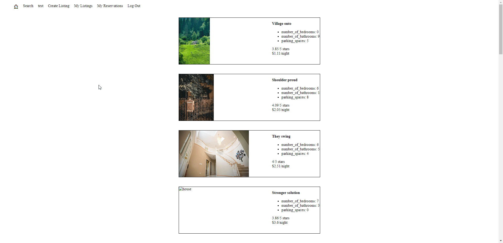
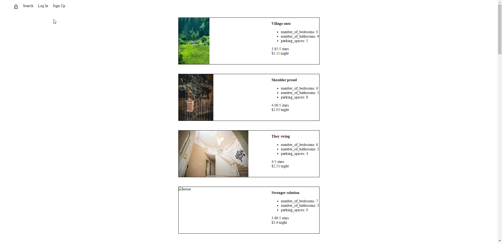

# LightBnB Project: Your Airbnb-Inspired Adventure Begins!

Welcome to **LightBnB** – where creativity meets functionality! 🏠✨ Dive into this multi-page Airbnb clone powered by the magic of server-side JavaScript and brought to life with dazzling SQL queries.

## Getting Started: Unleash the Potential

1. **Clone** this repository onto your local device.
2. Install dependencies using the `npm install` command.
3. Make your way to [LightBnB/LightBnB_WebApp-master](LightBnB_WebApp-master).
4. Start the web server using the `npm run local` command. The app will be served at [http://localhost:3000/](http://localhost:3000/).
5. Go to [http://localhost:3000/](http://localhost:3000/) in your browser.

## Unveiling LightBnB

🌐 As you step into the world of [http://localhost:3000/](http://localhost:3000/), behold the spectacle – **20 unique and captivating BnB locations**, each one a testament to the power of your queries.

## Join the Journey – Log In!

Beyond the horizon of the main page, the header beckons with simplicity and opportunity. The **home emoji** calls you back to the heart of the adventure. Yet, there's more – immerse yourself by logging in as an existing user or crafting your identity by signing up. No need for real-world credentials here – embrace your inner whimsy and create fantastical logins fit for a digital realm!

## Beyond the Gateway – Once You're In

A new star shines in the header – **'Create Listing.'** With this newfound power, you're not just a traveler; you're a creator. Unleash your imagination as you craft your very own LightBnB listing. Fill the text boxes with tales of your property, and with a triumphant click, watch it come to life in the database!

## Explore the Uncharted – Search Feature

Don't miss the hidden gem in the header – the **Search feature**. It's not just a filter; it's a treasure map leading you to the perfect listings. From quirky property names to outrageous prices, let the randomness enchant you!

## Dependencies

- Express
- Node v14.21.3x or above